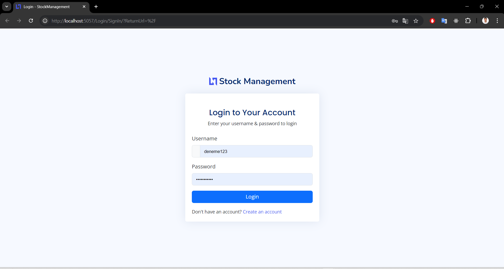
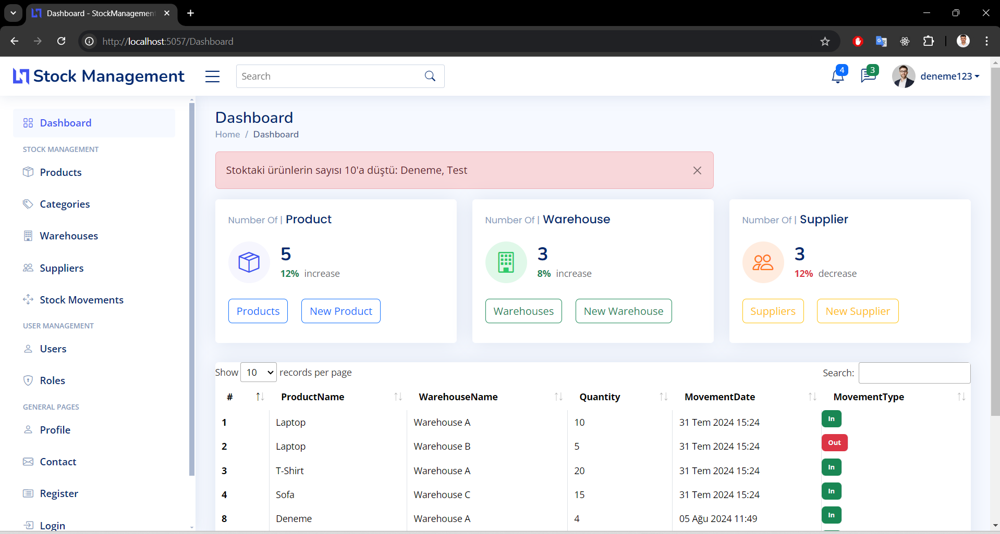
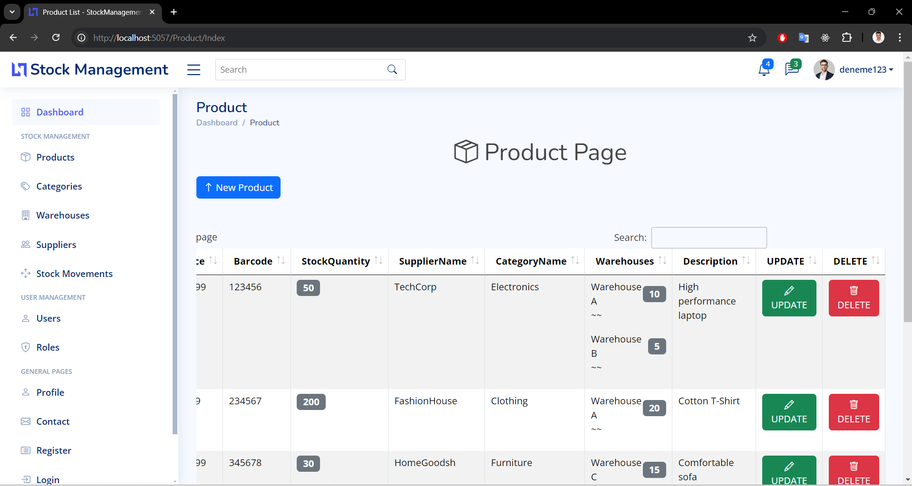
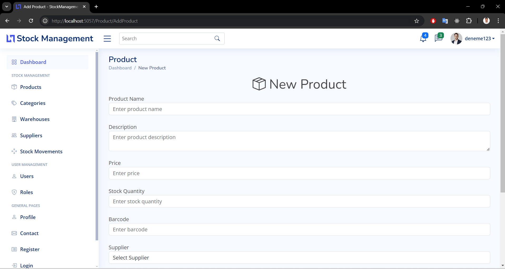
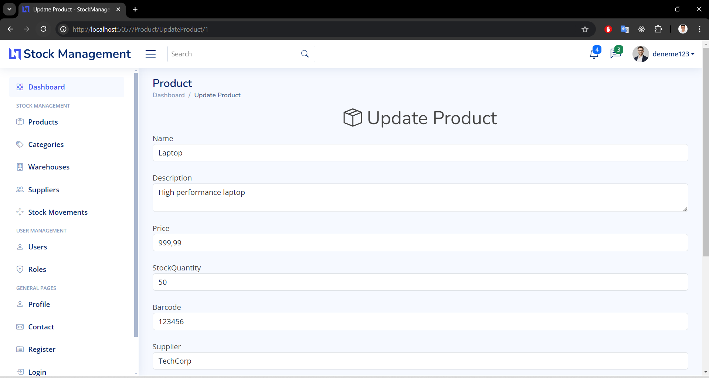
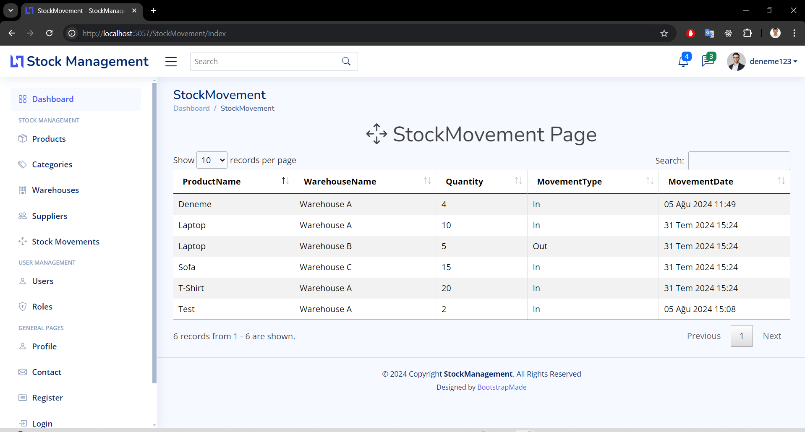
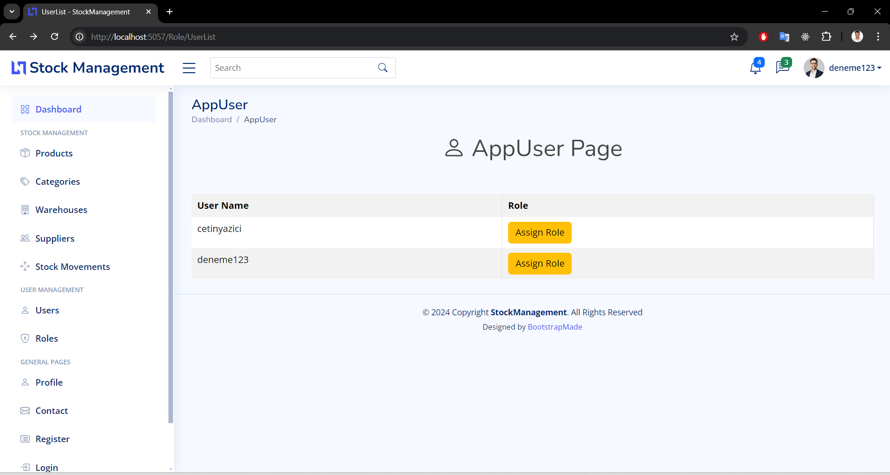
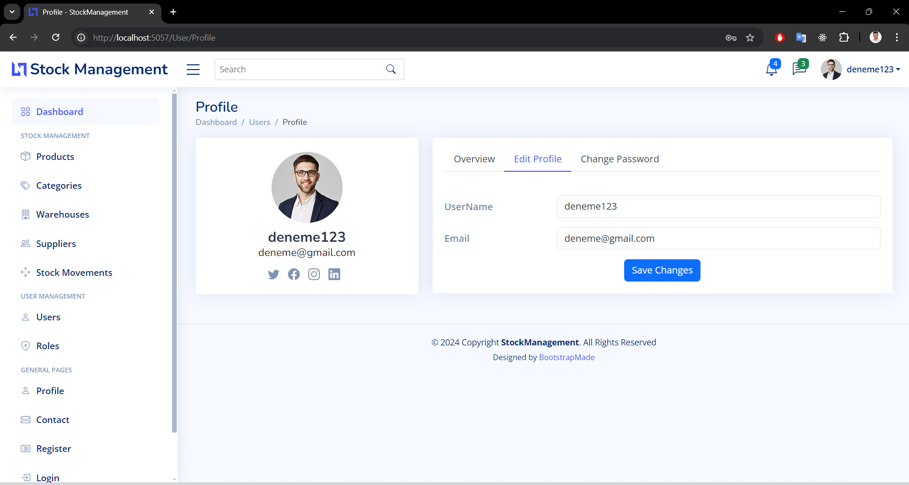
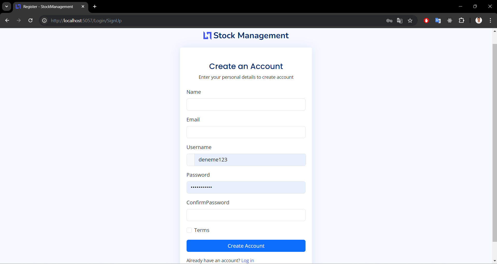

# StockManagementNet Project

## Overview

`StockManagementNet` is a comprehensive .NET-based stock management system utilizing ASP.NET Core and Entity Framework Core. This project focuses on managing stock data through effective CRUD operations for core entities such as `Product`, `Supplier`, `Warehouse`, and `StockMovement`. It also integrates user authentication and role-based access control using ASP.NET Core Identity, ensuring secure interactions and management of user roles.

The project also features user registration, role-based access control, and JWT-based authentication to ensure secure interactions. Razor Pages are used for server-side rendering, and Bootstrap is employed for a modern, responsive UI design.

## Features

- **Entity Management**: Efficiently manages core entities (`Product`, `Supplier`, `Warehouse`, `Category`, `StockMovement`) with CRUD operations.

- **Security Integration**: Utilizes ASP.NET Core Identity for user registration, authentication, and role-based access control.

- **Role-Based Access Control:**: Provides secure endpoints and user-specific permissions based on roles.

- **User Interface**: Employs Razor Pages for server-side rendering and Bootstrap for a modern, responsive design.

- **Modular Architecture:**: Organizes the project into distinct layers (Service, Repository, UI vb.) for improved manageability and scalability.

## Getting Started

### Prerequisites

- .NET 7 or higher
- Visual Studio or Visual Studio Code
- SQL Server or another RDBMS
- Entity Framework Core

### Installation

1. Clone the repository:

   ```bash
   git clone https://github.com/cetinyazici/StockManagementNet.git
   ```

2. Navigate to the project directory:
   ```bash
   cd stockManagementNet
   ```
3. Restore the project dependencies using .NET CLI:
   ```bash
   dotnet restore
   ```
4. Update the database connection settings: Edit the appsettings.json file to include your database configuration:
   ```bash
   "ConnectionStrings": {
      "DefaultConnection": "Server=localhost;Database=YourDatabase;User Id=yourusername;Password=yourpassword;"
      }
   ```
5. Apply database migrations:

   ```bash
   dotnet ef database update
   ```

6. Run the application:

   ```bash
   dotnet run
   ```

### Project images











### Project Summary

`StockManagementNet` is a robust .NET project designed for efficient stock management. It features comprehensive CRUD operations for core entities and incorporates ASP.NET Core Identity for secure user authentication and role-based access control. The project leverages ASP.NET Core and Entity Framework Core to provide a scalable and maintainable solution, with a modern UI built using Razor Pages and Bootstrap.

### Contact

- E-posta: cetin.yazici2525@gmail.com
- LinkedIn: [cetinyazici](https://www.linkedin.com/in/cetinyazici)
- GitHub: [cetinyazici](https://github.com/cetinyazici)
